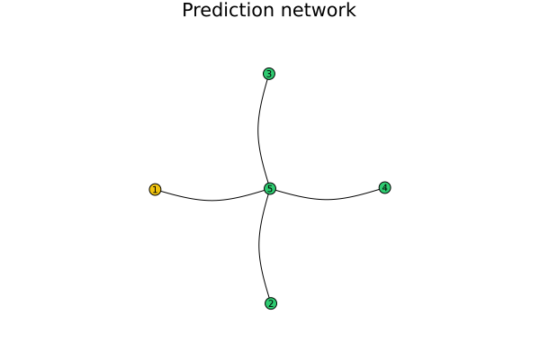

```@meta
CurrentModule = PredNets
```

# PredNets

Documentation for [PredNets](https://github.com/Eldeeqq/PredNets.jl).

--- 
This package allows to simulate distributed timeseries modelling on graph of 
predictors.


## Currently supported models
```MD
- AR
- MA
- ARMA
- ~~Kalman Filter~~
```
## Configuration
!!! info "config.yaml"
    In ordger to run the simulation a predictor graph must be apriori created.
    
    It is possible to create the graph manually, or using `.yaml` config file.
    The structure of the config file is as following:
    ```yml
    process:
        - vector
        - vector
            ...
        - vector
    nodes:
        - <model description>
    edges:
    -
        - U
        - V
    ...

    ```

!!! info "model coniguration"
    Each model has its own config definition, but they share mandatory parameters
    ``\sigma`` and ``\mu``, which represent the distribution for the external noise 
    when measuring the data.
     ```yml
    nodes:
        - model: "<model type>"
            noise_sigma: 1.4
            noise_mu: 0.0
            <model specific params>
    ```


!!! info "AR"
    AR needs only weights.
     ```yml
    nodes:
        - model: "AR"
            noise_sigma: 1.4
            noise_mu: 0.0
            weights:
                - B_1
                - B_2
                ...
                - B_n

    ```

!!! info "MA"
    MA needs weigts and `c`
     ```yml
    nodes:
        - model: "MA"
            noise_sigma: 1.4
            noise_mu: 0.0
            c: 0
            weights:
                - B_1
                - B_2
                ...
                - B_n

    ```

!!! info "ARMA"
    ARMA has `ar_params` and `ma_params` which each contains respective params.
     ```yml
    nodes:
        - model: "ARMA"
            noise_mu: 0.0
            noise_sigma: 1.4
            ar_params: ...
            ma_params: ...

    ```

## Minimal example
```julia
using PredNets

g = deserialize("./examples/minimal_example.yaml")

simulate!(g)

save_results(g; output_dir="outputs")
```
## List of functionality
```@index
```

```@autodocs
Modules = [PredNets]
```
